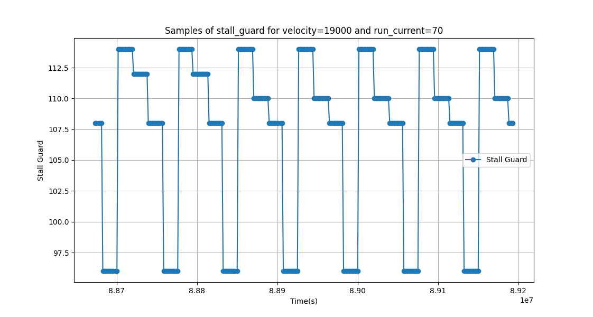
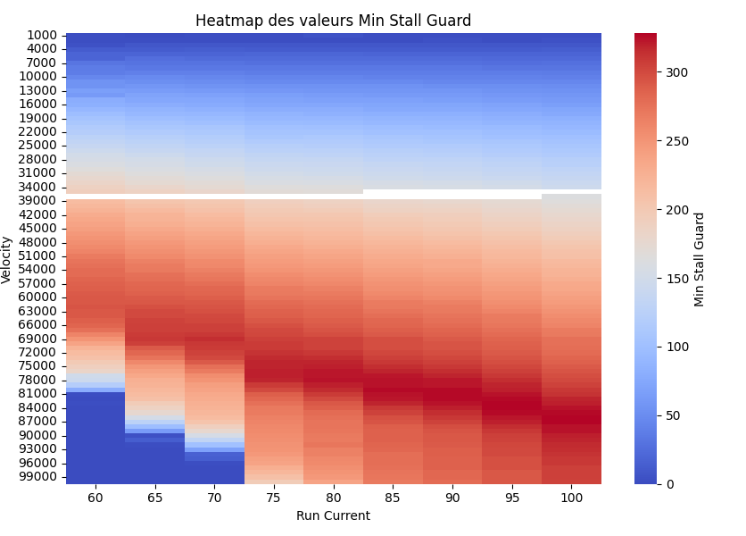

# Analyse du StallGuard

## Introduction

Le StallGuard est une fonctionnalité des drivers de moteurs pas-à-pas TMC2209 qui permet de détecter un blocage du moteur en mesurant le courant consommé par le moteur. Cette fonctionnalité est utilisée pour détecter les collisions et ainsi effectuer une calibration automatique des moteurs.

## Principe de fonctionnement

Le driver TMC2209 mesure une grandeur qui varie en fonction du couple résistant exercé sur l'arbre du moteur. Cette grandeur est appelée StallGuard et est récupérée par le microcontrôleur via une interface série grâce à la méthode `getStallGuardResult()` de la classe `TMC2209`. Plus la valeur de StallGuard est faible, plus le couple résistant est important. Pour détecter un blocage, il suffit de comparer la valeur de StallGuard à un seuil prédéfini. Le défis est de déterminer ce seuil.

## Expérimentation

Pour la suite des expérimentations, nous avons utilisé un moteur pas-à-pas NEMA 17 et un driver TMC2209-la. Le moteur est alimenté par une alimentation 24V. Le driver est connecté à un microcontrôleur ESP32 via une liaison série. Les microsteps sont configurés à 256.

### Échantillonnage de StallGuard

Premièrement, voici un exemple de l'évolution du stallGuard en fonction du temps. La vitesse du moteur est constante et tourne à vide.

On se rend compte que la valeur de StallGuard fluctue entre une valeur minimale et une valeur maximale avec une période et un schéma de variation régulier. Il serait sûrement possible d'isoler les causes de ces variations pour obtenir une valeur de seuil plus précise, mais cela n'est pas nécessaire pour notre application. 

Nous allons donc utiliser un simple seuillage. Par contre, il est important de noter que la valeur moyenne de StallGuard, ainsi que sa valeur minimale changent en fonction des conditions de fonctionnement du moteur. Les deux conditions les plus influentes sont la vitesse de rotation et le courant d'alimentation. Un grand nombre d'échantillons a été pris pour chaque condition afin de mieux comprendre le comportement du StallGuard. Attention, lors d'un changement de vitesse brusque, le couple résistant étant plus important à cause de l'inertie, la valeur de StallGuard diminue fortement. Il est donc nécessaire d'attendre un court instant la stabilisation de la vitesse avant de reprendre une mesure fiable.

[Ce code](sampling.cpp) flashé sur l'ESP32 permet de récupérer les données de StallGuard et de les afficher sur le moniteur série.
En parallèle, ce [script Python](FromSerial.py) permet d'enregistrer ces données dans un fichier CSV.
Les [données enregistrées](stall_guard_data.csv) ont ensuite été analysées avec ce [code](analyst.py) afin d'obtenir les valeurs de seuil en fonction de la vitesse et du courant :

# Conclusion

Il a été décidé d'utiliser le stallGuard pour deux configurations différentes, une pour une vitesse rapide et une pour une vitesse lente. D'après des tests expérimentaux sur la plateforme, avec les courroies tendues et le reste monté, les valeurs suivantes ont été retenues :
| Courant (%) | Vitesse (micropas/s) | Seuil StallGuard |
|-------------|----------------------|------------------|
| 100         | 84000                | 200              |
| 70          | 45000                | 185              |

Cette étude nous aide à définir un seuil de StallGuard en fonction de la vitesse et du courant pour la calibration automatique des moteurs. Il est important de noter que ces valeurs sont spécifiques à notre configuration et ne sont pas nécessairement applicables à d'autres configurations. Il est donc recommandé de réaliser une étude similaire pour chaque configuration.

## Licence

Ping²© 2024 by Antoine, Antoine, Robin, Simon, Thomas is licensed under [Creative Commons Attribution-NonCommercial-NoDerivatives 4.0 International](https://creativecommons.org/licenses/by-nc-nd/4.0/)
